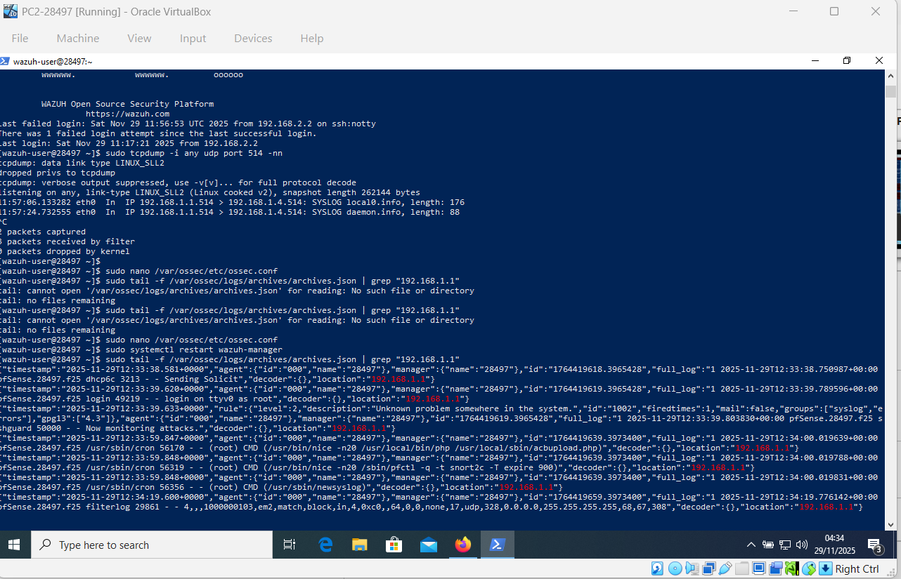
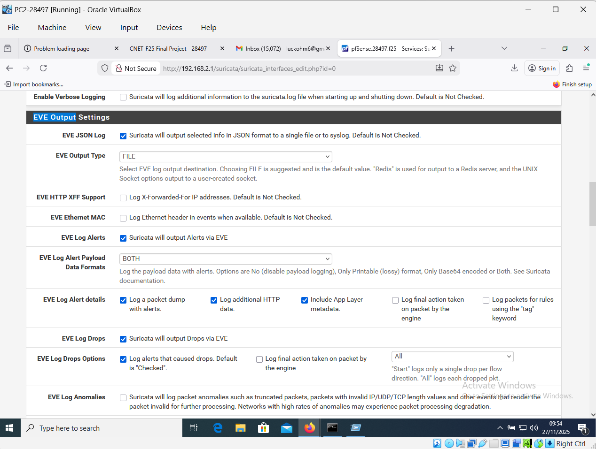

# Unified Threat Management & SIEM Integration Lab

## Objective
The goal of this project was to build a centralized security monitoring environment capable of detecting, alerting, and visualizing network threats and endpoint anomalies in real-time. 

## Architecture & Technologies Used
*   **SIEM:** Wazuh (Manager & Dashboard)
*   **Intrusion Detection (IDS):** Suricata
*   **Firewall:** pfSense
*   **Network Monitoring:** ntopng, arpwatch
*   **Endpoints:** Windows Server, Windows 10/11 Clients
*   **Attack Simulation:** Kali Linux

## Key Configurations
*   **Log Aggregation:** Configured endpoints to forward system and security logs to the Wazuh manager.
*   **Custom Alerting:** Wrote custom detection rules in Wazuh to trigger high-severity alerts for repeated failed logins (brute-force) and unauthorized scanning.
*   **File Integrity Monitoring (FIM):** Monitored `/var/www/html` and critical Windows roaming profiles for unauthorized modifications.

## Attack Simulation & Detection
To validate the defensive setup, I simulated an attack from a Kali Linux machine:
1.  **The Attack:** Executed an `nmap -sS -Pn` stealth scan against the internal network.
2.  **The Detection:** Suricata captured the signature, and Wazuh successfully generated a critical alert on the dashboard.
**Wazuh Detection Alert:**

**Suricata IDS Output:**

## Lessons Learned
*   Gained hands-on experience tuning IDS rules to reduce false positives.
*   Learned how to correlate firewall drop logs with endpoint security events to build a complete picture of an attack.
